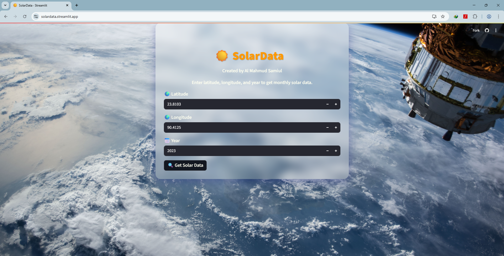
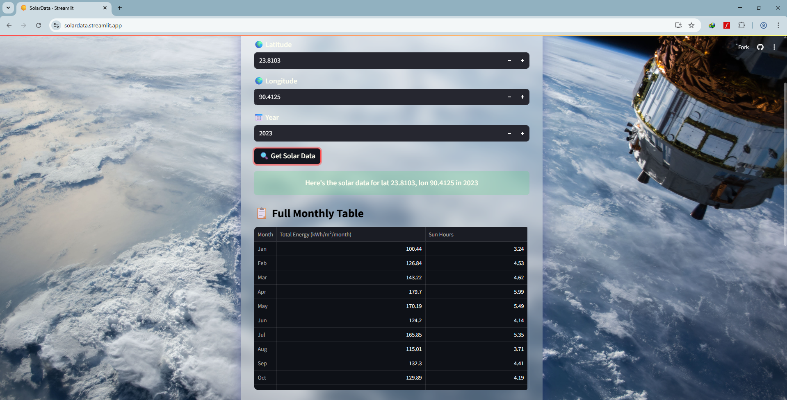
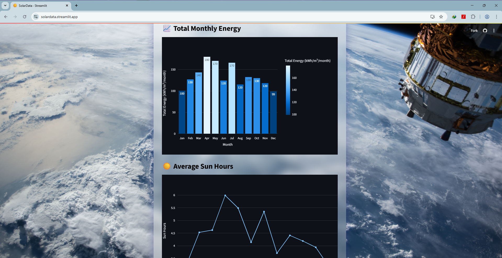

## Introduction
**SolarData is a web application built using Python and the Streamlit library that leverages the NASA API to fetch solar weather data. It provides detailed insights by displaying the monthly total solar power and average monthly sun hours for a specified location, based on its latitude and longitude, and the year selected by the user.**
URL : ```bash https://solardata.streamlit.app/```

### Work Method 
Simply provide the **latitude and longitude of any location**, these can be obtained from any website of your choice and **select the year** for which you want the data. The web app will then fetch and display the data for you in both **table and bar chart formats**.

### Screenshots

**Homepage View**



**Data Output Example**




### Run Locally
Step 1: Clone the repository to your local machine:
```bash
git clone https://github.com/samiul000/SolarData.git
```

Step 2: Extract the folder (if downloaded as a ZIP).

Step 3: Open your terminal or command palette, then navigate to the project folder.

Step 4: Run the Streamlit app with the following command:

```bash
streamlit run main.py
```
This will launch the web app in your default browser at ``localhost``.

**``Note: You need to obtain your own NASA API key to run the application locally.``**
